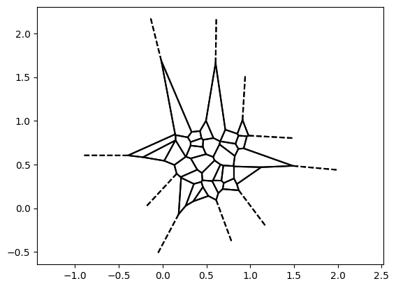
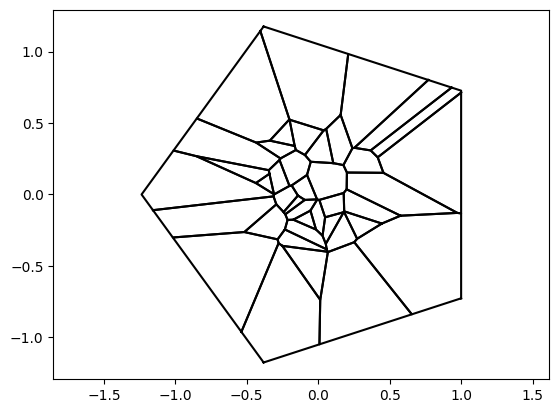
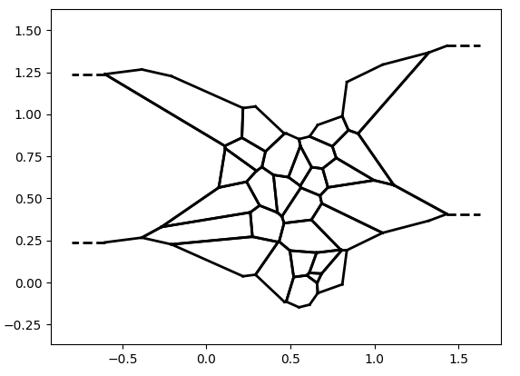
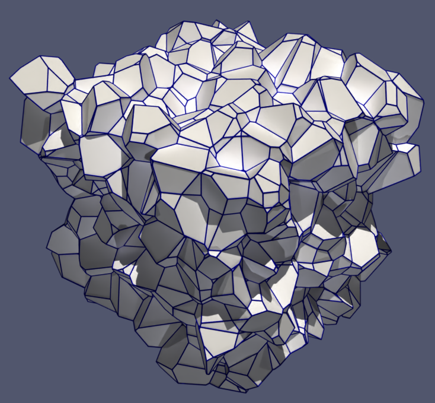
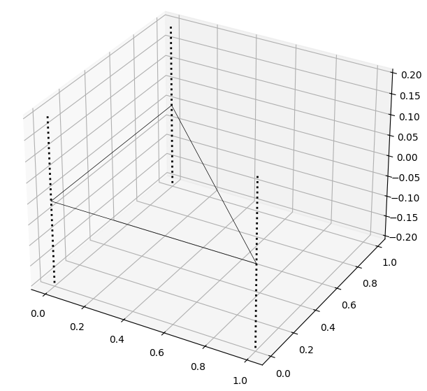
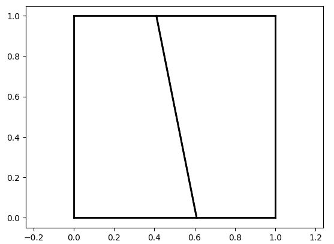

Power diagram
=============

Power diagram (or Laguerre diagram) can be considered as a generalization of Voronoi diagrams where each seeds has "weights", enabling displacement of the cells.

The convention is that $x$ is in cell $i$ if $\| x - \delta_i \|^2 - w_i < \| x - \delta_j \|^2 - w_j ,\ \forall j \neq i$.

In short, the `PowerDiagram` class 
* handles virtual seeds, for periodicity handling,
* works with any number of dimension (>= 1),
* can work with large vectors (notably for out-of-core or MPI computations),
* is able to give siblings, parents or chilren for all the kinds of geometric entities.

It is optionaly equiped with an underlying measure (Lebesgue by default), for methods like `cell_integrals`, `cell.boundary_integrals`...

Internally, it is optimized for multicore and SIMD/SIMT instruction sets.

Construction and visualization
-----------------------------

## Basic example

```python
from sdot import PowerDiagram

# we add some 2D seeds. By default, weights are equal to 1, leading to a voronoi diagram
pd = PowerDiagram( positions = np.random.random( [ 40, 2 ] ) )

# plot can take pyplot figure as input 
pd.plot( plt )
plt.show()
```

It gives something like:



## Boundaries

Bounds are opional. They are defined using affine functions as in:

```python
from sdot import PowerDiagram
import numpy as np

# we center the points around 0 for this example
pd = PowerDiagram( np.random.random( [ 40, 2 ] ) - 0.5 )

# Here we use a setter to set a value after the call of the constructor (we can do the same thing for positions, weights, ...)
# In this example we add 5 affine functions defined by the directions [ np.cos( a ), np.sin( a ) ] and offsets equal to 1
# A point x is exterior when `dot( direction, x ) - offset > 0` 
pd.boundaries = [ [ np.cos( a ), np.sin( a ), 1 ] for a in np.linspace( 0, 2 * np.pi, 5, endpoint=False ) ]

# if output context is not specified, `plot()` tries to find the best one and calls the corresponding `show` method
pd.plot()
```

This example should give something like:



## Periodicity

Periodicity is handled in sdot by virtual seed affine transformations. Everytime a user adds a transformation `T` (internally represented as a (nd+1)² matrix), sdot virtually adds a copy of the seed with `T` and `inverse( T )` transformations.

In this example, we add periodicity along the `y` axis:

```python
from sdot import PowerDiagram
import numpy as np

pd = PowerDiagram( np.random.random( [ 30, 2 ] ) )

# We virtually repeat the seeds with `[ 0, +1 ]` and `[ 0, -1 ]` translations.
#   Specifying `[ 0, +1 ]` is enough because internally, it will also add the inverse transformation.
#   Rk: each new transformation T is added with its inv( T ), P @ T and P @ inv( T ) for each previous transformation P
# The transformations are internaly stored as transformation matrices (4x4 in 3D for instance)
#   but can be constructed using tuple ( M, V ) to describe the transformation `M @ x + V` for a point `x`
#   or by a single vector for a simple translation
pd.periodicity_transformations = [
    ( np.eye( 2 ), [ 0, 1 ] )
]

pd.plot()
```



### VtkOutput

For large number of cells or complex 3D visualization, it is possible to generate files that can be read by softwares likes paraview...

Currently, only `.vtk` files are supported, but more are planed (via `PyVista`).

```python
from sdot import PowerDiagram, VtkOutput
import numpy as np

pd = PowerDiagram( np.random.random( [ 500, 3 ] ) )
pd.periodicity_transformations = [
    [1,0,0],
    [0,1,0],
    [0,0,1],
]

# plot understands the string as a filename and checks the extension to call the right plot function 
#  (there is a pd.plot_vtk() function)
pd.plot( "out.vtk" )
```



Cells
-----

### Sweeping

Cells can be scanned using the method `for_each_cell`. It calls the function given as argument with the cells (as instances of `Cell`).

`Cell` contains methods like `integral`, `boundaries`, ..., enabling individual computations, but most of theses methods have vectorized counterparts in the `PowerDiagram` class (prefixed with `cell_` and suffixed with a `s`). For instance for `cell.integral(...)` (with cell obtained for instance with `pd.for_each_cell`) there is a method `power_diagram.cell_integrals(...)` that returns a list with the results of each `cell.integral(...)` (the computation actually done in the C++ code).

One important comment: by default, to avoid unnecessary memory consumption, cells are computed on the fly. If the user plans to call methods that lead to the same cells being scanned several times (the diagram not being modified between the calls), and there's no particular memory pressure, it is possible to request caching with `power_diagram.use_cache = True` or set `use_cache = True` in argument of the methods.

### Lower dimensionality

Cells may be suported on space with lower dimensionnality. If it is the case, methods like `vertex_coords` or `vertex_refs` (list of cuts indices for each vertex) will return lists of arrays with size < dim (`.shape[ 1 ]` will be inferior to `ndim`).

It is illustrated in the following example 

```python
from sdot import Cell

cell = Cell( ndim = 3 )

# we create a triangle, infinitely extruded
cell.cut( [ -1,  0, 0 ], 0 )
cell.cut( [  0, -1, 0 ], 0 )
cell.cut( [ +1, +1, 0 ], 1 )

# naturally, there's no 3D vertex...
print( cell.nb_vertices ) # => 0

# and this cell is sill unbounded (in 3D)
print( cell.bounded ) # => False

# It's because we're in 2D
print( cell.true_dimensionality ) # => 2

# "td" is the shortcut for "true dimensionality".
# Method with with prefix return the information for the subspace defined by `cell.base`
print( cell.nb_vertices_td ) # => 3 (the 3 vertices of the triangle)

# we can get coordinates to represent these points in 3D
print( cell.vertex_coords_td @ cell.base ) # => [[0. 0. 0.] [1. 0. 0.] [0. 1. 0.]]

# visualization will show the 2D content with thiner lines
cell.plot()
```



Summary of coordinates, connectivity, parenting...
--------------------------------------------------

The method `PowerDiagram.summary` returns a `PowerDiagramSummary` object that contains arrays describing the fully computed power diagram. It contains the coordinates, the connectivity and parenting information.

For instance, for this simple power diagram

```python
from sdot import PowerDiagram

pd = PowerDiagram( [ [ 0.25, 0.5 ], [ 0.75, 0.6 ] ] )
pd.add_box_boundaries( 0, 1 )
ps = pd.summary()
```



we have

```python
# ps.vertex_coords => coordinates for each vertex
[[ 0.    0.  ]                                                       
 [ 0.41  1.  ]
 [ 0.    1.  ]
 [ 0.61  0.  ]
 [ 1.   -0.  ]
 [ 1.    1.  ]]

# ps.ref_lists[ 0 ] => references for item of dimensionality 0, i.e. for vertices
#   if `reference <  ps.nb_cells`, `reference` is a cell index
#   if `reference >= ps.nb_cells`, `reference` is a boundary index and equal to `ps.nb_cells + boundary_index`
# In other words, ps.ref_lists[ 0 ] describes how thet vertices have been constructed (by which cells and boundaries)
[[0 2 4]
 [0 1 5]
 [0 2 5]
 [0 1 4]
 [1 3 4]
 [1 3 5]]

# ps.ref_lists[ 1 ] => references for item of dimensionality 1, i.e. for edges and rays
[[2 4]
 [0 4]
 [0 2]
 [1 5]
 [0 5]
 [0 1]
 [2 5]
 [1 4]
 [3 4]
 [1 3]
 [3 5]]

# ps.parenting[ 2 ][ 0 ] => children of dim 0 (vertices) from items of dim 2 (faces)
[0, 1, 2, 3]
[1, 4, 3, 5]

# ps.parenting[ 1 ][ 2 ] => parents of dim 2 (faces) from items of dim 1 (edges)
[0]
[0]
[0, 1]
[0]
[1]
[1]
[1]

# ps.boundary_items => items indices of part that belong to each boundary item.
#   In this case, indices of edges included in each boudary item (by index of the boundary item)
# add_box_boundaries added the boundaries [ [-1,0,0], [1,0,1], [0,-1,0], [0,1,1] ] 
[[1], [6], [0, 5], [3, 4]]
```

Integrations
------------

The method `PowerDiagram.cell_integrals( f )` (or `Cell.integral( f )`) takes as input a symbolic formula. By default, it uses the `PowerDiagram.underlying_measure` and the `PowerDiagram.underlying_radius_function` expression so that the integral is equal to `integral( underlying_measure * underlying_radius_function * f, cell )`. If is possible to use another underlying measure of radius functions by using the `override_...` arguments.

`f` can be a scalar or a list, a list of list, ...

```python
# a simple triangle
c = Cell( ndim = 2 )
c.cut( [-1, 0 ], 0 )
c.cut( [ 0,-1 ], 0 )
c.cut( [ 1, 1 ], 1 )

# c.integral() => integration of 1 on the cell
0.5

# c.integral([]) => integration of 1 on the cell
0.5


```

