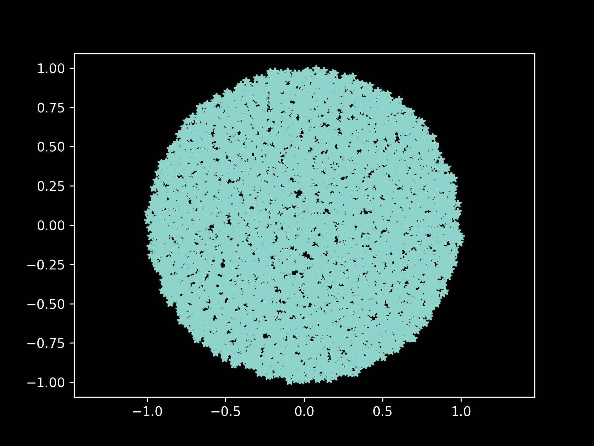

This example demonstrates how to reconstruct a 2D density from its projections using the semi-discrete Optimal Transport (W2 distance). It uses the L-BFGS optimizer to find the optimal coordinates of Dirac points.

{ align=center width=600 }

## Python Implementation

--8<-- "docs/examples/ct_reconstruction/ct_reconstruction.py"
